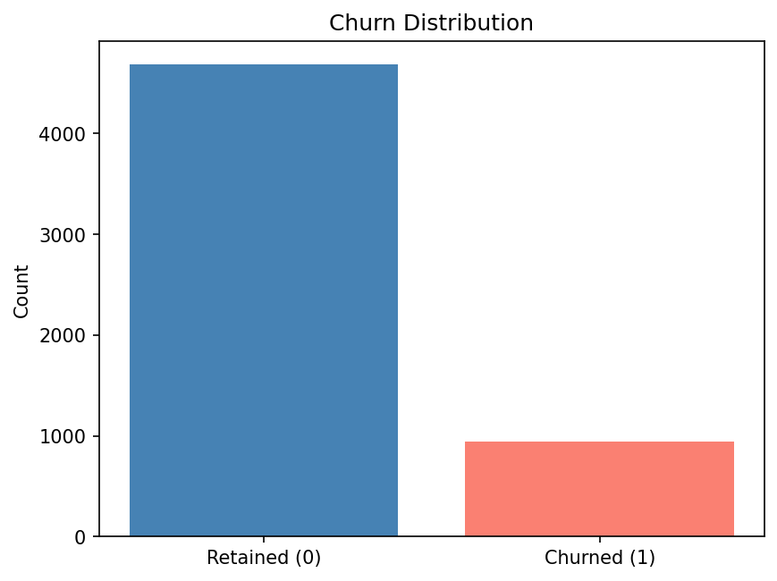
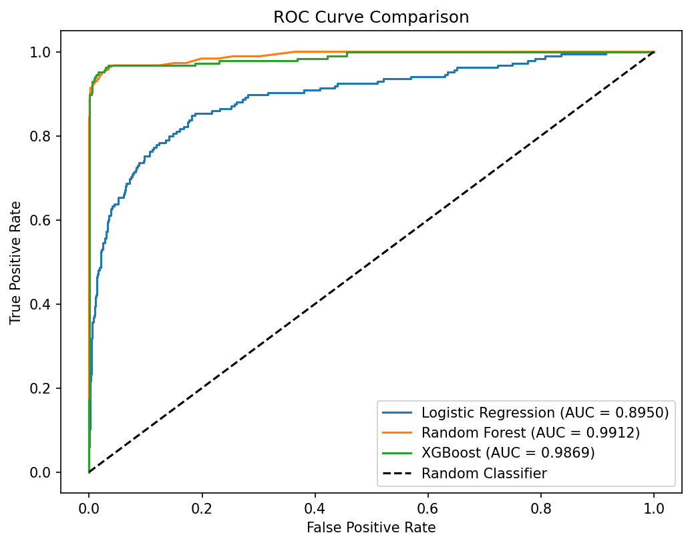
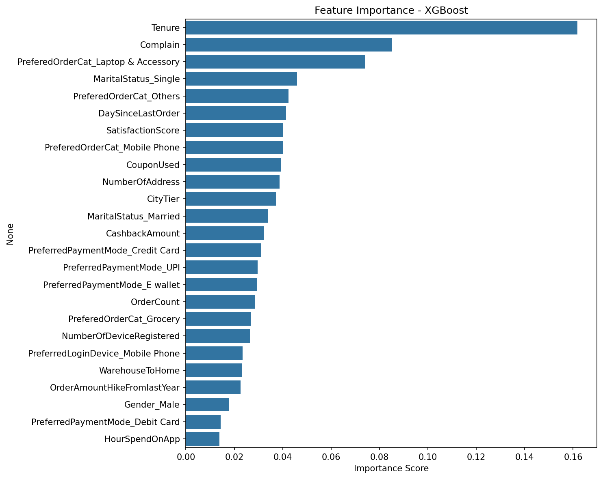
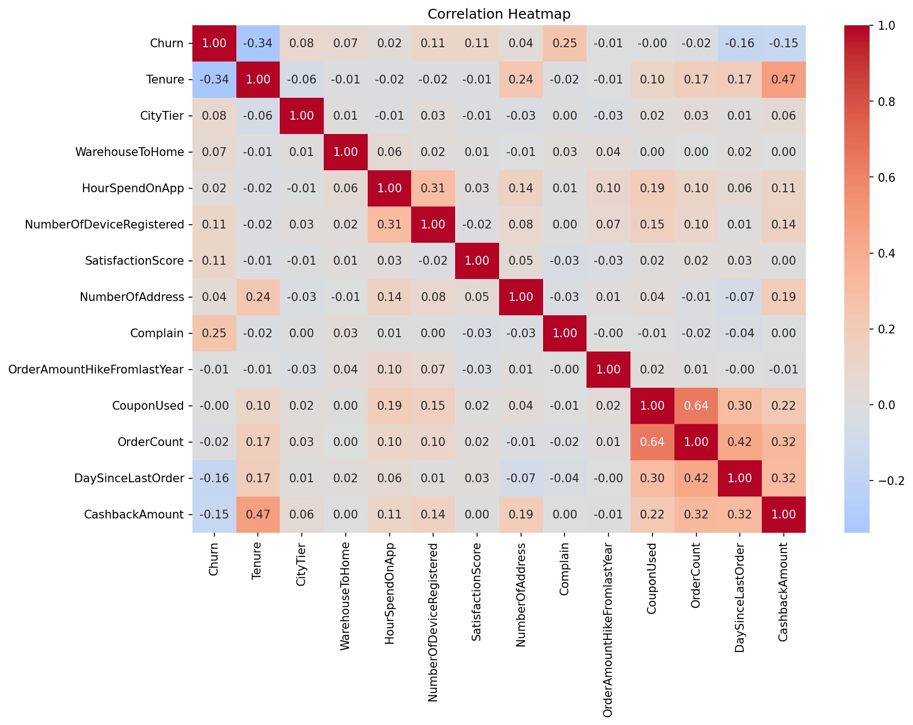

# E-Commerce Customer Churn Prediction

## 📌 Overview
This project builds a machine learning model to predict customer churn 
in an e-commerce platform and quantifies the financial impact of 
retention campaigns through cost-benefit analysis.

**Key Questions:**
- Which customers are likely to churn?
- At what threshold does the retention campaign maximize cost savings?

**Result: 95.8% cost reduction (35,460 USD) compared to no-intervention baseline**

---

## 📂 Project Structure
```
ecommerce_churn/
├── E_Commerce.ipynb          # Full analysis notebook
├── images/                   # Visualizations
└── README.md                 # Project documentation
```

## 📊 Dataset
- **Source**: E-Commerce Customer Churn Dataset (Kaggle)
- **Size**: 5,630 customers, 20 features
- **Target**: Churn (0 = Retained, 1 = Churned)

Key features include Tenure, Complain, SatisfactionScore, 
PreferredPaymentMode, MaritalStatus, and more.

---

## 🔍 Methodology

### 1. Data Cleaning
- Removed duplicate category values (CC → Credit Card, COD → Cash on Delivery)
- Imputed missing values with median
- Dropped CustomerID

### 2. Exploratory Data Analysis
- Analyzed churn distribution across numerical and categorical variables
- Identified key hypotheses for modeling

### 3. Modeling
- Compared Logistic Regression, Random Forest, and XGBoost
- Selected XGBoost mainly based on Recall and F1-score

### 4. Cost-Benefit Analysis
- Optimized classification threshold to minimize total business cost
- Quantified financial impact of retention campaigns

---
## 📈 Visualizations

### Churn Distribution


### ROC Curve Comparison


### Feature Importance


### Cost by Threshold


### Correlation Heatmap


---

## 📊 Results
| | Value |
|---|---|
| Best Model | XGBoost |
| AUC | 0.9869 |
| Recall (Churn=1) | 0.93 |
| Optimal Threshold | 0.11 |
| Cost Saving vs No Model | 35,460 USD (95.8%) |

---

## 🛠️ Tech Stack
- Python 3.13
- pandas, numpy, matplotlib, seaborn
- scikit-learn, xgboost

---
